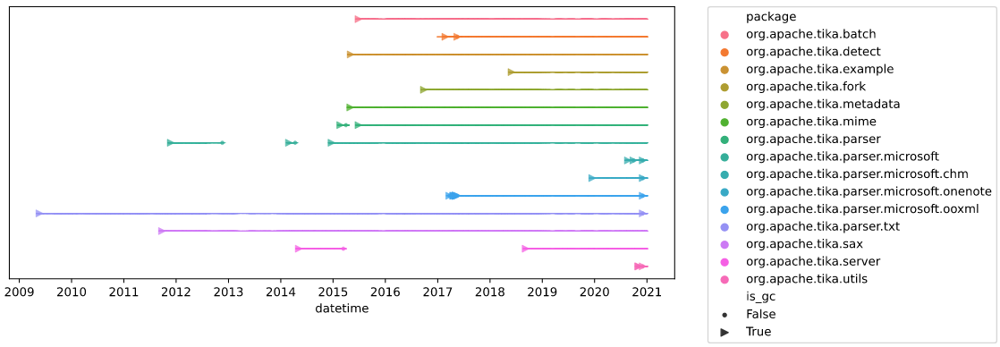

# God Components in Apache Tika
How did big, bulky software components come into being? In this project, we explore the evolution of so-called _God Components_; pieces of software with a large number of classes or lines of code that got very large over time. Our analysis was run on the [Apache Tika](https://tika.apache.org/) codebase.

Check out the [Juypter Notebook](https://dunnkers.com/god-components):

[](https://dunnkers.com/god-components)

Or see the [Google Slides](https://docs.google.com/presentation/d/e/2PACX-1vR7K3OXOYntmhZGBF5LnIPyOMtfLJlcgEjjMS9Kl0h3PLi6C_rnJKLjjXxd3nzIvR5PCgmt17wQ87kS/pub?start=false&loop=false&delayms=3000):

[](https://docs.google.com/presentation/d/e/2PACX-1vR7K3OXOYntmhZGBF5LnIPyOMtfLJlcgEjjMS9Kl0h3PLi6C_rnJKLjjXxd3nzIvR5PCgmt17wQ87kS/pub?start=false&loop=false&delayms=3000)


## Running project code
The analysis process consists out of two steps: (1) fetching the data using _Designite_ and (2) analyze the data using a Jupyter Notebook.

### (1) Running Designite
Code to investigate God Components for every version (commit) of the code is under `/src`. First, set your DesigniteJava Enterprise key to a environment variable, like so:

```shell
export DESIGNITE_ENTERPRISE=<your_key>
```

We also rely on some dependencies, so create a virtual environment using:

```shell
python3 -m venv venv
source venv/bin/activate
pip3 install -r src/requirements.txt
```

Put the command in `.bashrc` or `.zshrc` to persist the environment variable. **Now, to run the analysis, execute:**

```shell
python3 src/find-gcs.py
```

This will clone tika repositories under `/storage/repositories` and run Designite for all commits. It will continue where it left off if you cancel the process. When it's finished, it will combine all reports in a single one at `/output/all_reports.csv`. To only execute the `.csv` reports aggregation process, run:

```shell
python3 src/find-gcs.py --skip
```

Which will, once finished, create a big file containing all reports at `/output/all_reports.csv`.

#### Running on Peregrine
The process might take a while. For that reason, the `find-gcs.py` program is built to be executed in parallel. By default, it utilises all your available CPU's. To speed up even more, however, running on _Peregrine_ might be desired.

To run on Peregrine, ssh into Peregrine, clone this repo there and execute:

```shell
sbatch src/peregrine.sh
```

The program will automatically utilise all Peregrine cores available on the given node ✨

### (2) Grabbing Jira issues
We another data source for our analysis: data from Tika's Jira issue tracker. We can fetch the Jira issues as follows:

```shell
python3 src/jira_issues.py
```

... which fetches information on *all* Jira issues using its API. It then stores the results to `/output/all_issues.csv`.

### (3) Computing Lines Of Code data
Lastly, let's compute the Lines Of Code added/removed per GC.

```shell
python3 git_utils_test.py
```

... which runs the testing script for `git_utils`, executing simple tests on the functions as well as saving the data to `/output`. Data on commits is stored under `/output/all_commits.csv` and data on Lines Of Code is stored under `/output/all_locs.csv`.

### (4) Analyzing the data
Once we have all the data, let's analyse it! For this, we use a Jupyter Notebook, `statistics.ipynb`. It contains written text notes, images and code; it should be self-explanatory 🙂.

→ For ease of access, we also hosted the Notebook on a webpage: [dunnkers.com/god-components](https://dunnkers.com/god-components).

## Report
Latex report source is under `/report`, built PDF available in submission.

## About
Project during the Software Maintance and Evolution course `WMCS013-05.2020-2021.1B` at the University of Groningen.

By [Jeroen Overschie](https://dunnkers.com/) and Konstantina Gkikopouli.
